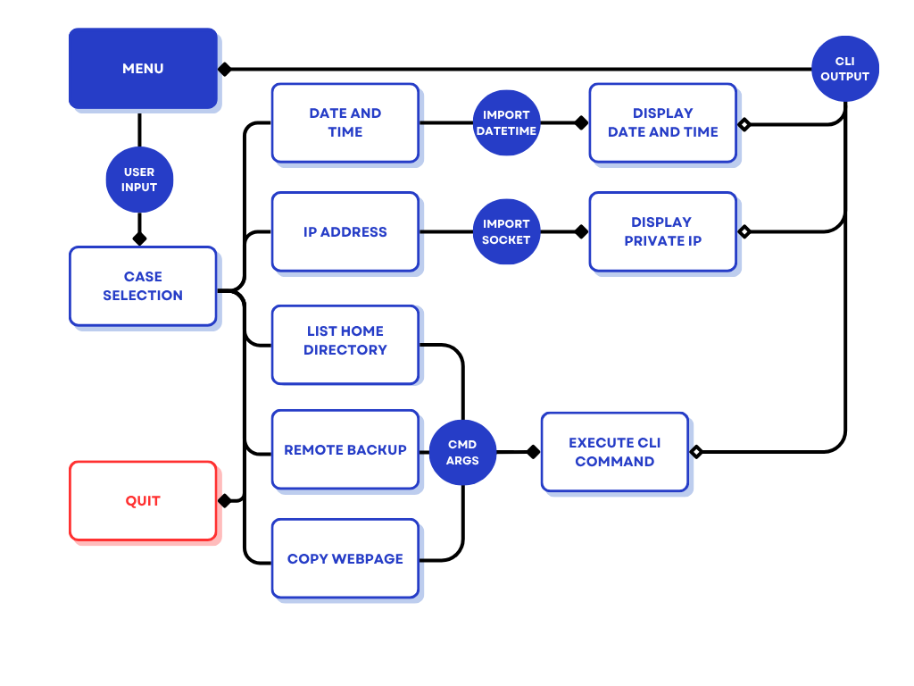

# Intro to Architecture and Automation Project

A simple Python CLI tool that provides a menu with six functions for managing a remote machine, getting host details (e.g., IP address, Date and Time), and scraping the HTML of a user designated webpage.

## Features

* **Function 1:** Show date and time (local computer)
* **Function 2:** Show IP address (local computer)
* **Function 3:** Show remote home directory listing
* **Function 4:** Backup remote file
* **Function 5:** Save web page
* **Function 6:** Quit

## Requirements

* Python 3.x
* Paramiko
* socket
* sys
* subprocess
* datetime
* urllib
* shlex

## Installation

1.  Clone the repository:
    ```bash
    git clone [https://github.com/2442903/Intro-Architecture-Automation.git](https://github.com/2442903/Intro-Architecture-Automation.git)
    cd Intro-Architecture-Automation
    ```

2.  Install the required dependencies using `pip`:
    ```bash
    pip install -r requirements.txt
    ```

3.  Run the main script:
    ```bash
    python Project.py
    ```

## Screenshot

Here is a a flowchart of the basic functions of the program:


